# distributed-transaction

이 레포지토리는 [주문시스템으로 알아보는 분산트랜잭션](https://www.inflearn.com/course/%EC%A3%BC%EB%AC%B8%EC%8B%9C%EC%8A%A4%ED%85%9C%EC%9C%BC%EB%A1%9C-%EC%95%8C%EC%95%84%EB%B3%B4%EB%8A%94-%EB%B6%84%EC%82%B0%ED%8A%B8%EB%9E%9C%EC%9E%AD%EC%85%98/news?srsltid=AfmBOooQslkAOakFKOdbYBUOMbsuAL8eOwz9iumPmyCearvhyhLLedBb) 강의를 바탕으로 정리한 내용입니다.

## 목차
- [프로젝트 세팅](#프로젝트-세팅)
  - [1. DB 세팅](#1-db-세팅)
  - [2. 요구사항 정의](#2-요구사항-정의)
  - [3.주문 로직 구현](#주문-로직-구현)
    - [3-1. 데이터 정합성 문제](#3-1-데이터-정합성-문제)
    - [3-2. 동일한 주문 문제](#3-2-동일한-주문-문제)
    - [3-3. 여러 번 실행되는 문제](#3-3-여러-번-실행되는-문제)
      - [Redis 세팅](#redis-세팅)
      - [Redis Lock 구현](#redis-lock-구현)
- [MSA로 전환하기](#msa로-전환하기)
  - [1. Monolithic](#1-monolithic)
    - [장점](#장점)
    - [단점](#단점)
  - [2. MSA](#2-msa)
    - [장점](#장점-1)
    - [단점](#단점-1)
  - [3. MSA로 전환하면서 발생하는 문제점](#3-msa로-전환하면서-발생하는-문제점)
    - [3-1. Monolithic 트랜잭션 처리](#3-1-monolithic-트랜잭션-처리)
    - [3-2. MSA 트랜잭션 처리](#3-2-msa-트랜잭션-처리)
    - [3-3. 분산 트랜잭션을 보장하기 위한 방법](#3-3-분산-트랜잭션을-보장하기-위한-방법)
- [MSA 환경에서 트랜잭션 제어하는 방법](#msa-환경에서-트랜잭션-제어하는-방법)
  - [1. 2PC (Two-Phase Commit)](#1-2pc-two-phase-commit)
    - [1-1. 2PC란?](#1-1-2pc란)
    - [1-2. 장애 시나리오와 문제점](#1-2-장애-시나리오와-문제점)
    - [1-3. MySQL XA 트랜잭션을 이용한 실습](#1-3-mysql-xa-트랜잭션을-이용한-실습)
    - [1-4. 장점](#1-4-장점)
    - [1-5. 단점](#1-5-단점)
    - [1-6. 실무에서는?](#1-6-실무에서는)
  - [2. TCC (Try-Confirm-Cancel)](#2-tcc-try-confirm-cancel)
    - [2-1. TCC란?](#2-1-tcc란)
    - [2-2. 장점](#2-2-장점)
    - [2-3. 단점](#2-3-단점)
    - [2-4. 일시적 오류에 대처하기](#3-일시적-오류에-대처하기)
      - [재고 예약은 성공적으로 마쳤지만 포인트 사용 예약 실패하는 경우](#재고-예약은-성공적으로-마쳤지만-포인트-사용-예약-실패하는-경우)
      - [커넥션은 확보했지만 포인트 시스템 내부에서 db 커넥션을 얻지 못해서 일시적 오류가 발생한 경우](#커넥션은-확보했지만-포인트-시스템-내부에서-db-커넥션을-얻지-못해서-일시적-오류가-발생한-경우)
      - [타임아웃이 발생하는 경우](#타임아웃이-발생하는-경우)
      - [해결책: 재시도 전략](#해결책-재시도-전략)
    - [2-5. TCC 패턴의 데이터 불일치 상태와 해소 전략](#2-5-tcc-패턴의-데이터-불일치-상태와-해소-전략)
      - [Confirm 단계 실패로 인한 'Pending' 상태 해소 전략](#confirm-단계-실패로-인한-pending-상태-해소-전략)
      - [Try 또는 Cancel 단계 실패로 인한 리소스 불일치 해소 전략](#try-또는-cancel-단계-실패로-인한-리소스-불일치-해소-전략)
  - [3. Saga](#3-saga)
    - [3-1. Saga란?](#3-1-saga란)
    - [3-2. Orchestration](#3-2-orchestration)
      - [장점](#장점-2)
      - [단점](#단점-2)
      - [현재 구조의 문제점과 해결 방법](#현재-구조의-문제점과-해결-방법)
    - [3.3. Choreography](#33-choreography)
      - [장점](#장점-3)
      - [단점](#단점-3)
      - [Kafka란?](#kafka란)

# 프로젝트 세팅
## 1. DB 세팅
```
# Docker Run
$ docker run -d -p 3306:3306 \
    -e MYSQL_ROOT_PASSWORD=1234 --name mysql mysql
    
# 실행 결과 확인
$ docker ps

# DB 테이블 생성
$ docker exec -it mysql bash     # Docker Container Bash 접속
$ mysql -u root -p 1234           # mysql 접속
$ CREATE DATABASE commerce_example; # DB Table 생성
$ USE commerce_example;         
```

## 2. 요구사항 정의
- 주문 데이터를 저장해야 한다.
- 재고 관리를 해야 한다.
- 포인트를 사용해야 한다.
- 주문, 재고, 포인트 데이터의 정합성이 맞아야 한다.
- 동일한 주문은 1번만 이루어져야 한다.

## 3. 주문 로직 구현
```java
public void placeOrder(PlaceOrderCommand command) {
    Order order = orderRepository.save(new Order());
    Long totalPrice = 0L;

    for (PlaceOrderCommand.OrderItem item : command.orderItems()) {
        OrderItem orderItem = new OrderItem(order.getId(), item.productId(), item.quantity());
        orderItemRepository.save(orderItem);

        Long price = productService.buy(item.productId(), item.quantity());
        totalPrice += price;
    }

    pointService.use(1L, totalPrice);
}
```

```http request
POST http://localhost:8080/order/place
Content-Type: application/json

{
    "orderItems": [
        {
            "productId": 1,
            "quantity": 2
        },
        {
            "productId": 2,
            "quantity": 2
        }
    ]
}
```


### 3-1. 데이터 정합성 문제
- Order 저장과 Product 저장은 성공했지만 Point 저장이 실패하면 Point 저장이 되지 않고 Order, Product 저장은 된 상태가 됨
- 해결책: 트랜잭션의 원자성을 이용해서 모두 성공하거나 모두 실패하게 만들기

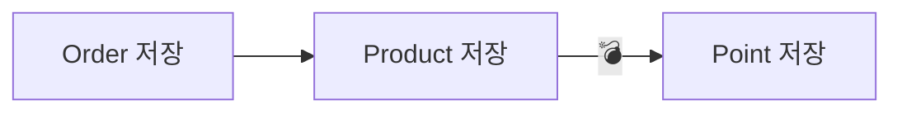
```mermaid
graph LR
  A[Order 저장] --> B[Product 저장]
  B -->|💣| C[Point 저장]
```

```java
@Transactional
public void placeOrder(PlaceOrderCommand command) {
    ...
}
```

### 3-2. 동일한 주문 문제
- 동일한 주문이 여러 번 실행됨
- 해결책: 주문 id를 클라이언트에게 반환하여 동일한 주문인지 판별

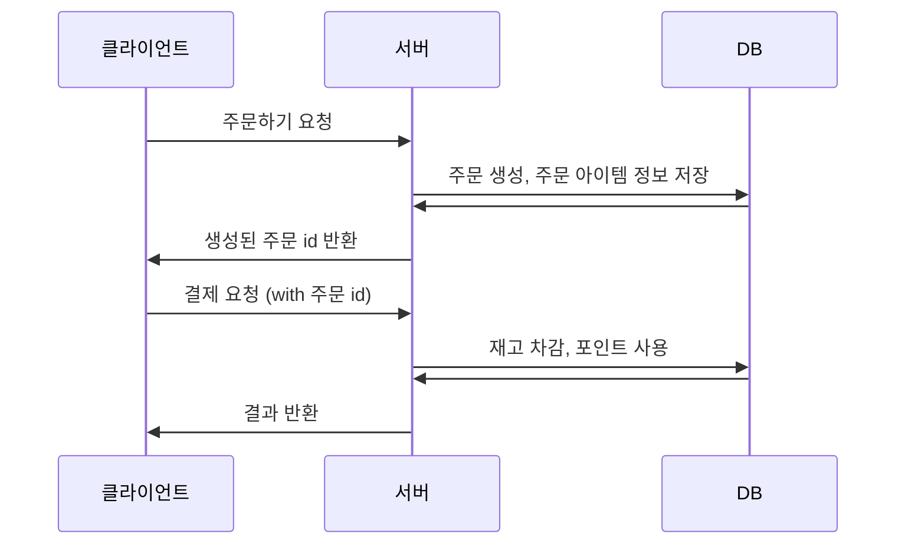
```mermaid
sequenceDiagram
    participant 클라이언트
    participant 서버
    participant DB
    
    클라이언트->>서버: 주문하기 요청
    서버->>DB: 주문 생성, 주문 아이템 정보 저장
    DB->>서버: 
    서버->>클라이언트: 생성된 주문 id 반환
    클라이언트->>서버: 결제 요청 (with 주문 id)
    서버->>DB: 재고 차감, 포인트 사용
    DB->>서버: 
    서버->>클라이언트: 결과 반환
```

### 3-3. 여러 번 실행되는 문제
- 위 과정을 통해 동일한 주문을 판별할 수 있지만, 여러 번 실행되는 문제는 여전히 존재
- 해결책: 여러 번 실행되지 않도록 Lock 활용

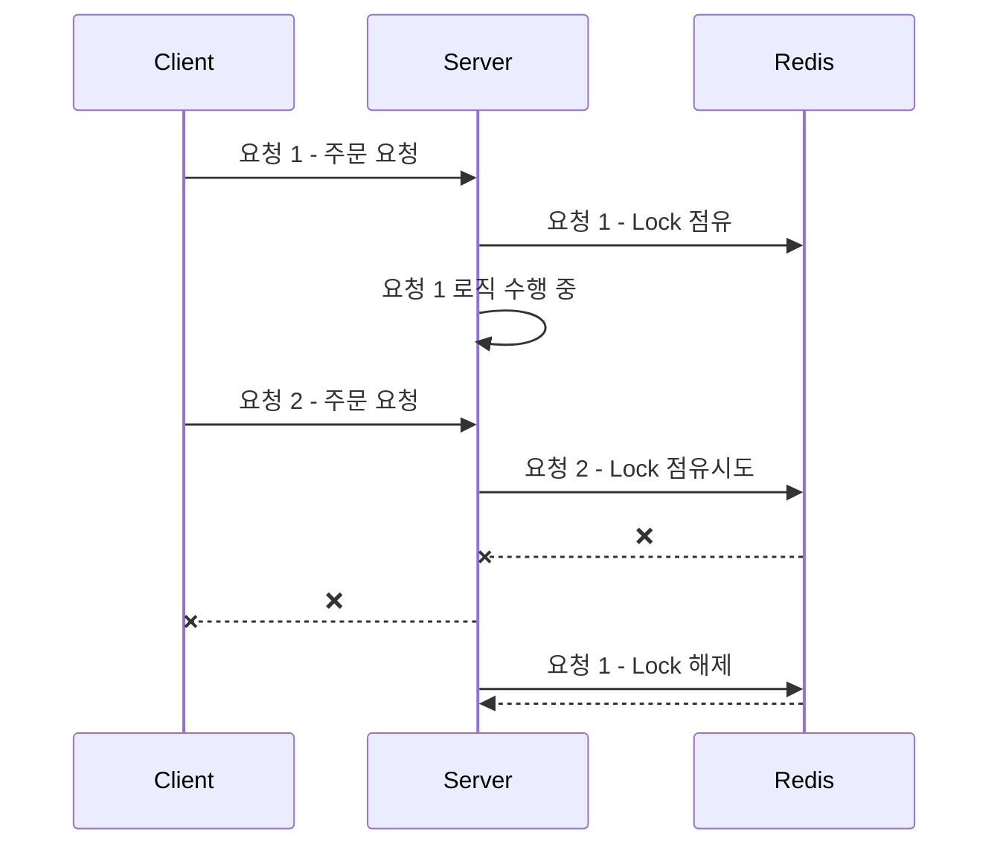
```mermaid
sequenceDiagram
    participant Client
    participant Server
    participant Redis
    
    Client ->> Server: 요청 1 - 주문 요청
    Server ->> Redis: 요청 1 - Lock 점유
    Server ->> Server: 요청 1 로직 수행 중
    
    Client ->> Server: 요청 2 - 주문 요청
    Server ->> Redis: 요청 2 - Lock 점유시도
    Redis --x Server: ❌
    Server --x Client: ❌
    
    Server ->> Redis: 요청 1 - Lock 해제
    Redis -->> Server: 
```

#### Redis 세팅
```
docker pull redis
docker run --name myredis -p 6379:6379 -d redis
docker exec -it myredis redis-cli
```

#### Redis Lock 구현
```java
@Service
public class RedisLockService {

    private final StringRedisTemplate stringRedisTemplate;

    public RedisLockService(StringRedisTemplate stringRedisTemplate) {
        this.stringRedisTemplate = stringRedisTemplate;
    }

    public boolean tryLock(String key, String value) {
        return stringRedisTemplate.opsForValue().setIfAbsent(key, value);
    }

    public void releaseLock(String key) {
        stringRedisTemplate.delete(key);
    }
}
```

# MSA로 전환하기
## 1. Monolithic
- 현재 아키텍처는 모놀리식 아키텍처
- 재고, 주문, 결제가 하나의 애플리케이션에 포함된 구조
- 서비스 전체가 단일 애플리케이션으로 묶여 있어 결합도가 높음.
- 빌드와 배포가 한 번에 가능
- 특정 기능의 성능을 높이려면 전체 애플리케이션을 확장해야 함.

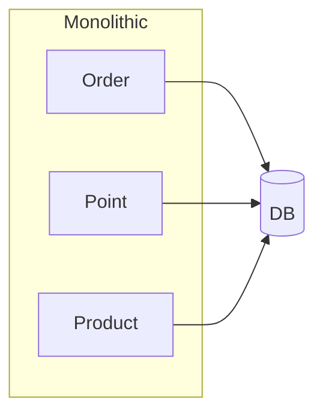
```mermaid
flowchart LR
    subgraph Monolithic
        Order[Order]
        Point[Point]
        Product[Product]
    end

    Order --> DB[(DB)]
    Point --> DB[(DB)]
    Product --> DB[(DB)]
```

### 장점
- 구조가 단순해서 빠른 개발과 테스트 가능
- 트랜잭션 관리 용이

### 단점
- 서비스가 커질수록 유지보수와 확장이 어려움

## 2. MSA
- MSA(Microservices Architecture)는 기능을 여러 개의 작고 독립적인 서비스로 나누어 운영하는 아키텍처
- 각 서비스는 도메인 단위로 분리되어 독립적으로 운영
- 개별적으로 빌드와 배포 가능
- 다른 기술 스택 사용 가능
- 성능 확장이 필요한 부분만 선택적으로 확장 가능

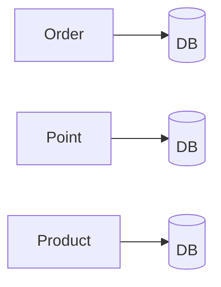
```mermaid
flowchart LR
  Order[Order] --> OrderDB[(DB)]
  Point[Point] --> PointDB[(DB)]
  Product[Product] --> ProductDB[(DB)]
```

### 장점
- 도메인 별로 팀 구성, 기술스택 선택 -> 유연성 증가

### 단점
- 초기 인프라 구성과 모니터링 운영 복잡도 증가
- 트랜잭션 관리의 어려움

## 3. MSA로 전환하면서 발생하는 문제점
- 서비스 간 데이터 정합성을 보장하기가 까다로워짐.

### 3-1. Monolithic 트랜잭션 처리
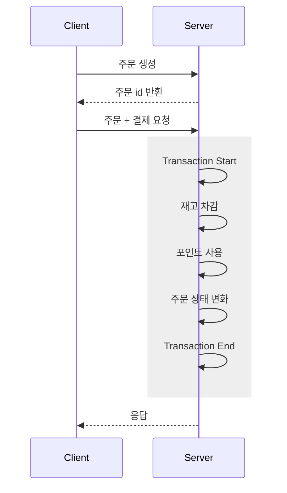
```mermaid
sequenceDiagram
    participant Client
    participant Server

    Client ->> Server: 주문 생성
    Server -->> Client: 주문 id 반환
    Client ->> Server: 주문 + 결제 요청

    rect rgba(200,200,200,0.3)
        Server ->> Server: Transaction Start
        Server ->> Server: 재고 차감
        Server ->> Server: 포인트 사용
        Server ->> Server: 주문 상태 변화
        Server ->> Server: Transaction End
    end

    Server -->> Client: 응답
```

### 3-2. MSA 트랜잭션 처리
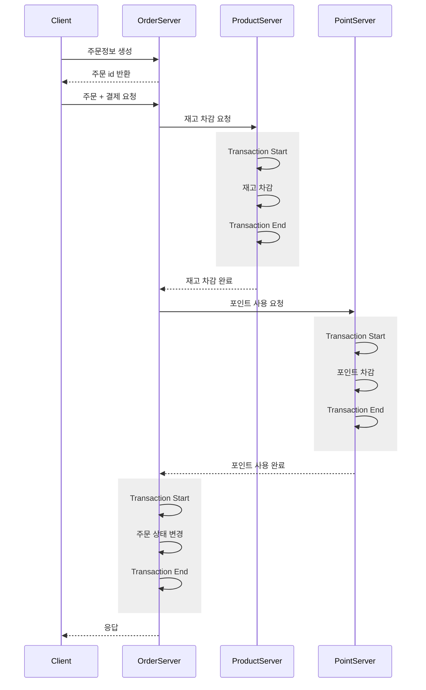
```mermaid
sequenceDiagram
  participant Client
  participant OrderServer
  participant ProductServer
  participant PointServer

  Client ->> OrderServer: 주문정보 생성
  OrderServer -->> Client: 주문 id 반환
  Client ->> OrderServer: 주문 + 결제 요청

  OrderServer ->> ProductServer: 재고 차감 요청
  rect rgba(200,200,200,0.3)
    ProductServer ->> ProductServer: Transaction Start
    ProductServer ->> ProductServer: 재고 차감
    ProductServer ->> ProductServer: Transaction End
  end

  ProductServer -->> OrderServer: 재고 차감 완료

  OrderServer ->> PointServer: 포인트 사용 요청
  rect rgba(200,200,200,0.3)
    PointServer ->> PointServer: Transaction Start
    PointServer ->> PointServer: 포인트 차감
    PointServer ->> PointServer: Transaction End
  end

  PointServer -->> OrderServer: 포인트 사용 완료

  rect rgba(200,200,200,0.3)
    OrderServer ->> OrderServer: Transaction Start
    OrderServer ->> OrderServer: 주문 상태 변경
    OrderServer ->> OrderServer: Transaction End
  end

  OrderServer -->> Client: 응답
```

### 3-3. 분산 트랜잭션을 보장하기 위한 방법
- 2PC
- TCC
- SAGA

# MSA 환경에서 트랜잭션 제어하는 방법
## 1. 2PC (Two-Phase Commit)
### 1-1. 2PC란?
- 분산 시스템에서 트랜잭션의 원자성을 보장하기 위해 사용되는 프로토콜
- 트랜잭션을 두 단계로 나누어 처리
  - Prepare 단계: 트랜잭션 매니저가 참여자에게 작업 준비 가능성 확인
  - Commit 단계: Prepare 단계에서 모든 참여자가 준비되었다고 응답하면 트랜잭션 매니저가 Commit 명령을 보내 작업 완료
- 대표적인 구현으로는 XA 트랜잭션이 존재

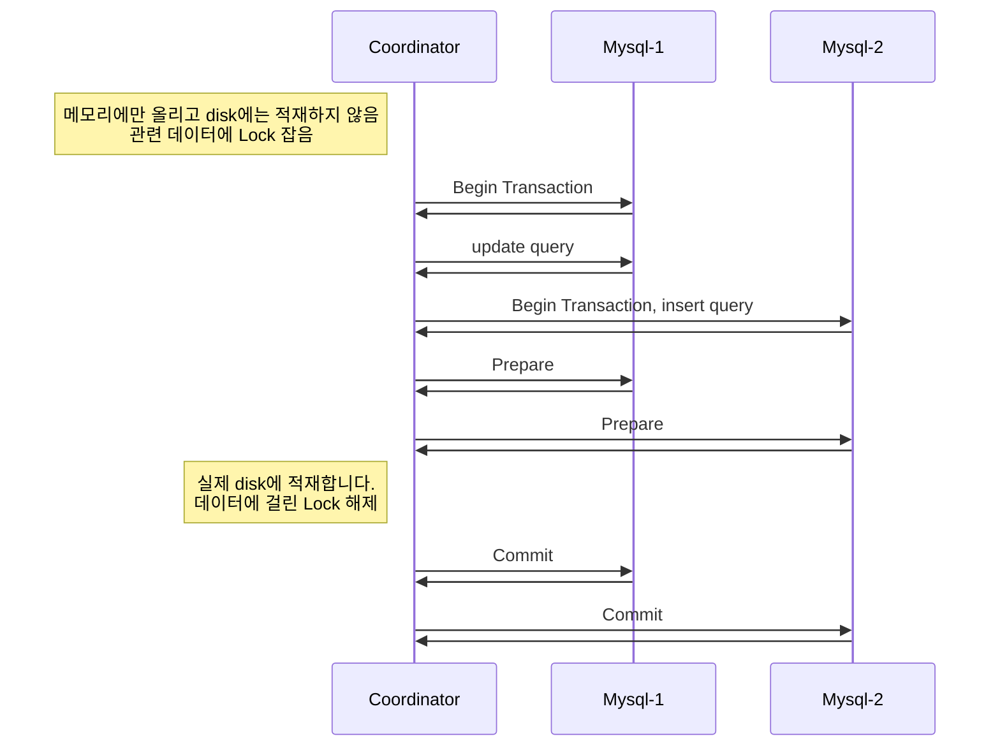
```mermaid
sequenceDiagram
    participant Coordinator
    participant Mysql-1
    participant Mysql-2

    Note left of Coordinator: 메모리에만 올리고 disk에는 적재하지 않음<br>관련 데이터에 Lock 잡음

    Coordinator->>Mysql-1: Begin Transaction
    Mysql-1->>Coordinator: 
    Coordinator->>Mysql-1: update query
    Mysql-1->>Coordinator: 
    Coordinator->>Mysql-2: Begin Transaction, insert query
    Mysql-2->>Coordinator: 

    Coordinator->>Mysql-1: Prepare
    Mysql-1->>Coordinator: 
    Coordinator->>Mysql-2: Prepare
    Mysql-2->>Coordinator: 

    Note left of Coordinator: 실제 disk에 적재합니다.<br>데이터에 걸린 Lock 해제

    Coordinator->>Mysql-1: Commit
    Mysql-1->>Coordinator: 
    Coordinator->>Mysql-2: Commit
    Mysql-2->>Coordinator: 
```

### 1-2. 장애 시나리오와 문제점
- 트랜잭션을 얻어오고 쿼리 수행을 모두 했지만 Prepare 단계에서 실패한다면 데이터베이스는 롤백을 하게 됨
- Prepare 단계까지 모두 성공했지만 Commit 단계에서 실패한다면 데이터베이스는 커밋을 하지 못하고 대기 상태로 남게 됨
  - Prepare 단계 이후 참여자는 스스로 롤백을 하면 안 되기 때문에 Coordinator의 커밋 또는 롤백 명령을 기다림
  - 커밋 명령이 일시적으로 실패했다면 Coordinator는 커밋을 재시도 해야 함 -> 트랜잭션의 원자성 유지하기 위한 핵심 절차
  - Mysql-2가 커밋이 불가능한 경우 사람이 수동으로 커밋하거나 데이터 조작을 해야 함.
  - Mysql-2가 락을 잡고 있어 다른 곳에서는 접근할 수 없게 됨.

### 1-3. MySQL XA 트랜잭션을 이용한 실습
- 터미널 창 3개를 연다.

```mysql
# 터미널 1
CREATE DATABASE 2pc1;
use 2pc1;
CREATE TABLE product 
(
    id INT PRIMARY KEY,
    quantity INT
);
insert into product values (1, 1000);
xa start 'product_1';
update product set quantity = 900 where id = 1;
xa end 'product_1';

# 터미널 2
CREATE DATABASE 2pc2;
use 2pc2;
CREATE TABLE point
(
    id INT PRIMARY KEY,
    amount INT
);
xa start 'point_1';
insert into point values (1, 1000);
xa end 'point_1';

# 터미널 3
use 2pc1;
update product set quantity = 800 where id = 1; # lock 걸림
```

```mysql
# 터미널 1
xa prepare 'product_1';
xa commit 'product_1';

# 터미널 2
xa prepare 'point_1';
xa commit 'point_1';

# 터미널 3
# lock 해제 후 update 쿼리 수행됨
```

### 1-4. 장점
- 강력한 정합성 보장 -> 분산 트랜잭션 상황에서 여러 자원에 대한 트랜잭션을 하나처럼 처리할 수 있게 해줌.
- 사용하는 데이터베이스 XA를 지원한다면 구현 난이도가 낮음.

### 1-5. 단점
- 제한된 호환성: 사용하는 데이터베이스 XA를 지원하지 않는다면 구현이 어려움.
- 낮은 가용성: prepare 단계 이후 커밋이 완료될 때까지 락 유지(관련된 로우나 언두 로그 등을 유지하면서 대기)
- 장애 복구 어려움: 장애 복구 시 수동 개입 필요

### 1-6. 실무에서는?
- 2PC 보다는 다른 방법을 사용하여 분산 트랜잭션 구현

## 2. TCC (Try-Confirm-Cancel)
### 2-1. TCC란?
- 분산 시스템에서 데이터 정합성을 보장하기 위해 사용하는 분산 트랜잭션 처리 방식
- 전통적인 트랜잭션은 데이터베이스의 커밋과 롤백에 의존하는 반면, TCC는 애플리케이션 레벨에서 논리적으로 트랜잭션을 관리
  - Try 단계: 필요한 리소스를 점유할 수 있는지 검사하고 임시로 예약
  - Confirm 단계: 실제 리소스를 확정 처리하여 반영
  - Cancel 단계: 문제가 생긴 경우, 예약 상태를 취소하여 원복
- Try, Confirm, Cancel 단계는 멱등하게 설계되어야 함.

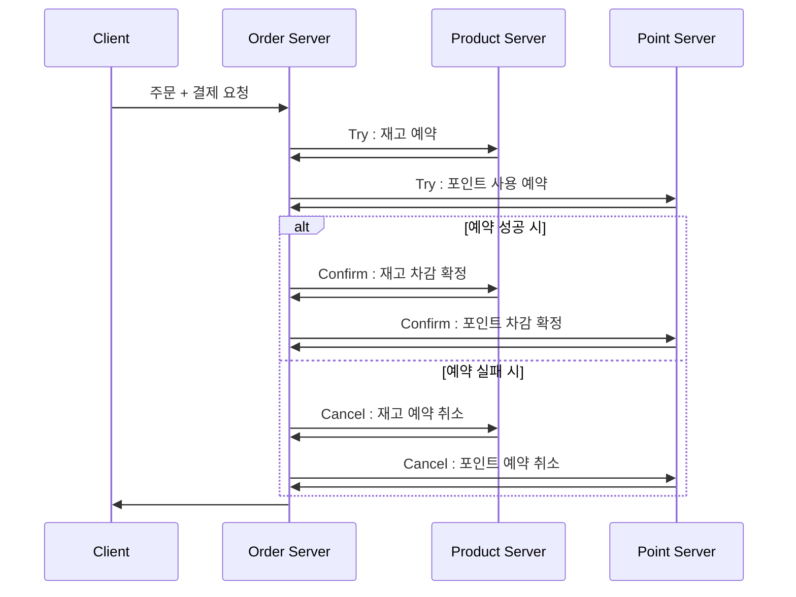
```mermaid
sequenceDiagram
    participant Client
    participant Order Server
    participant Product Server
    participant Point Server

    Client->>Order Server: 주문 + 결제 요청

    Order Server->>Product Server: Try : 재고 예약
    Product Server->>Order Server: 
    Order Server->>Point Server: Try : 포인트 사용 예약
    Point Server->>Order Server: 

    alt 예약 성공 시
        Order Server->>Product Server: Confirm : 재고 차감 확정
        Product Server->>Order Server: 
        Order Server->>Point Server: Confirm : 포인트 차감 확정
        Point Server->>Order Server: 
    else 예약 실패 시
        Order Server->>Product Server: Cancel : 재고 예약 취소
        Product Server->>Order Server: 
        Order Server->>Point Server: Cancel : 포인트 예약 취소
        Point Server->>Order Server: 
    end
    Order Server->>Client: 
```
### 2-2. 장점
- 확장성과 성능에 유리
  - 2PC에 비해 데이터베이스 Lock 점유 시간이 짧음.
  - 2PC에 비해 Long Transaction에 덜 취약
- 장애 복구와 재시도 처리에 유연

### 2-3. 단점
- 구현 복잡성 증가
  - 모든 단계 (Try, Confirm, Cancel)를 멱등하게 설계해야 함.
  - 네트워크 오류, 재시도 시나리오를 고려한 복잡한 로직 필요

### 2-4. 일시적 오류에 대처하기
- MSA 환경에서는 네트워크 오류 혹은 일시적 장애가 발생할 수 있어, 이를 고려해야 함.

#### 재고 예약은 성공적으로 마쳤지만 포인트 사용 예약 실패하는 경우

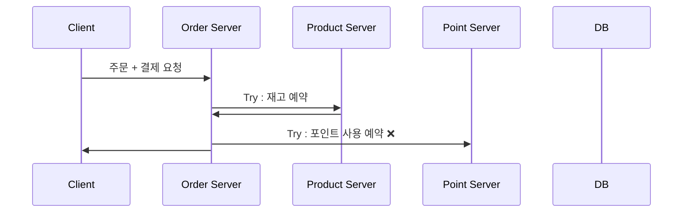
```mermaid
sequenceDiagram
    participant Client
    participant Order Server
    participant Product Server
    participant Point Server
    participant DB

    Client->>Order Server: 주문 + 결제 요청
    Order Server->>Product Server: Try : 재고 예약
    Product Server->>Order Server: 
    Order Server->>Point Server: Try : 포인트 사용 예약 ❌
    Order Server->>Client: 
```

#### 커넥션은 확보했지만 포인트 시스템 내부에서 db 커넥션을 얻지 못해서 일시적 오류가 발생한 경우

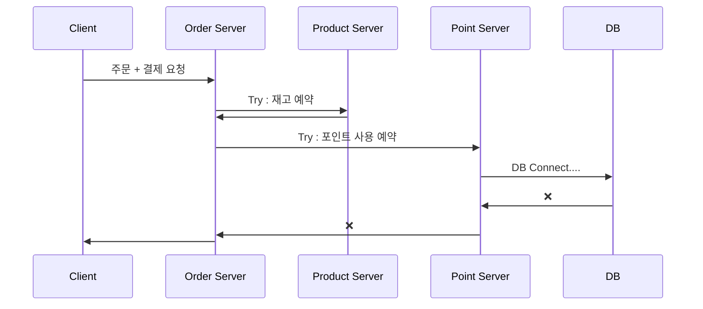
```mermaid
sequenceDiagram
    participant Client
    participant Order Server
    participant Product Server
    participant Point Server
    participant DB

    Client->>Order Server: 주문 + 결제 요청
    Order Server->>Product Server: Try : 재고 예약
    Product Server->>Order Server: 
    Order Server->>Point Server: Try : 포인트 사용 예약
    Point Server->>DB: DB Connect....
    DB->>Point Server: ❌
    Point Server ->>Order Server: ❌
    Order Server->>Client: 
```

#### 타임아웃이 발생하는 경우

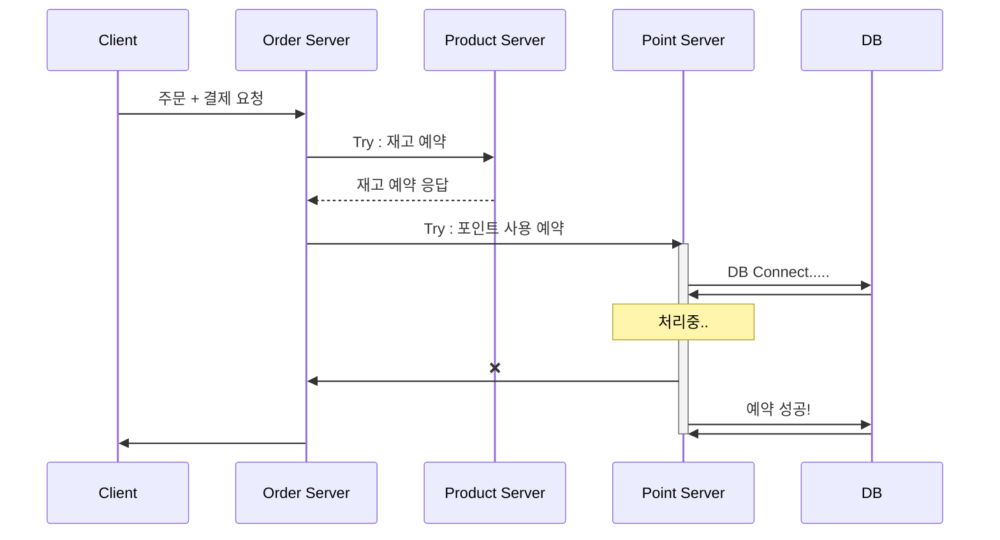
```mermaid
sequenceDiagram
    participant Client
    participant Order Server
    participant Product Server
    participant Point Server
    participant DB

    Client ->> Order Server: 주문 + 결제 요청
    Order Server ->> Product Server: Try : 재고 예약
    Product Server -->> Order Server: 재고 예약 응답
    Order Server ->> Point Server: Try : 포인트 사용 예약
    activate Point Server
    Point Server ->> DB: DB Connect.....
    DB->>Point Server: 
    note over Point Server: 처리중..
    Point Server->> Order Server: ❌
    Point Server->>DB: 예약 성공!
    DB->>Point Server: 
    deactivate Point Server

    Order Server->>Client: 
```

#### 해결책: 재시도 전략
- 일시적인 요청으로 실패한 경우 곧바로 재고 예약을 취소하는 방식보다는 재시도 방식을 통해 정상 처리로 유도하는 것이 더 바람직함.
- 재시도 전략은 시스템의 신뢰성을 높이고 불필요한 보상 처리 비용을 줄일 수 있음.
- 다만, 재시도 전략을 안전하게 적용하기 위해서는 시스템이 반드시 멱등성을 보장하도록 설계되어야 함.

### 2-5. TCC 패턴의 데이터 불일치 상태와 해소 전략
#### Confirm 단계 실패로 인한 'Pending' 상태 해소 전략

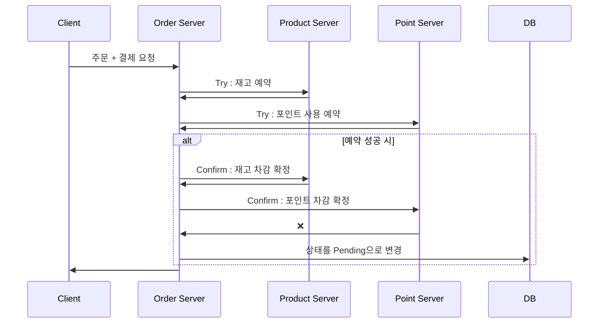
```mermaid
sequenceDiagram
    participant Client
    participant Order Server
    participant Product Server
    participant Point Server
    participant DB

    Client->>Order Server: 주문 + 결제 요청

    Order Server->>Product Server: Try : 재고 예약
    Product Server->>Order Server: 

    Order Server->>Point Server: Try : 포인트 사용 예약
    Point Server->>Order Server: 

    alt 예약 성공 시
        Order Server->>Product Server: Confirm : 재고 차감 확정
        Product Server->>Order Server: 
        Order Server->>Point Server: Confirm : 포인트 차감 확정
        Point Server->>Order Server: ❌
        Order Server->> DB: 상태를 Pending으로 변경
    end

    Order Server->>Client: 
```

**발생할 수 있는 경우**

|케이스|Order|Product|Point|
|---|---|---|---|
|1|Pending|Reserved|Reserved|
|2|Pending|Confirmed|Reserved|
|3|Pending|Confirmed|Confirmed|

> 예를 들어, 사용자가 오류를 겪은 후 동일한 상품을 재주문하여 성공했다면, 이전의 Pending 주문을 자동으로 확정하면 의도치 않은 중복 주문이 발생합니다.

**Pending 상태 해소를 위한 관리자 개입 유도**

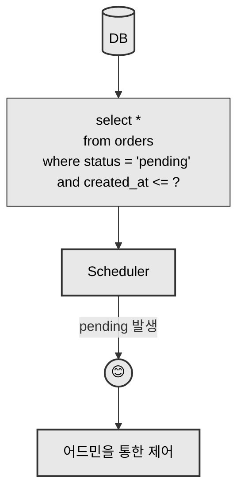
```mermaid
graph TB
    DB[(DB)]
    Query["select *<br/>from orders<br/>where status = 'pending' and created_at <= ?"]
    Scheduler[Scheduler]
    Process((😊))
    EventHandler["어드민을 통한 제어"]

    DB --> Query
    Query --> Scheduler
    Scheduler -->|pending 발생|Process
    Process --> EventHandler

    style DB fill:#e8e8e8,stroke:#333,stroke-width:2px,color:#000
    style Query fill:#e8e8e8,stroke:#333,stroke-width:1px,color:#000
    style Scheduler fill:#e8e8e8,stroke:#333,stroke-width:2px,color:#000
    style Process fill:#e8e8e8,stroke:#333,stroke-width:2px,color:#000
    style EventHandler fill:#e8e8e8,stroke:#333,stroke-width:2px,color:#000
```

#### Try 또는 Cancel 단계 실패로 인한 리소스 불일치 해소 전략

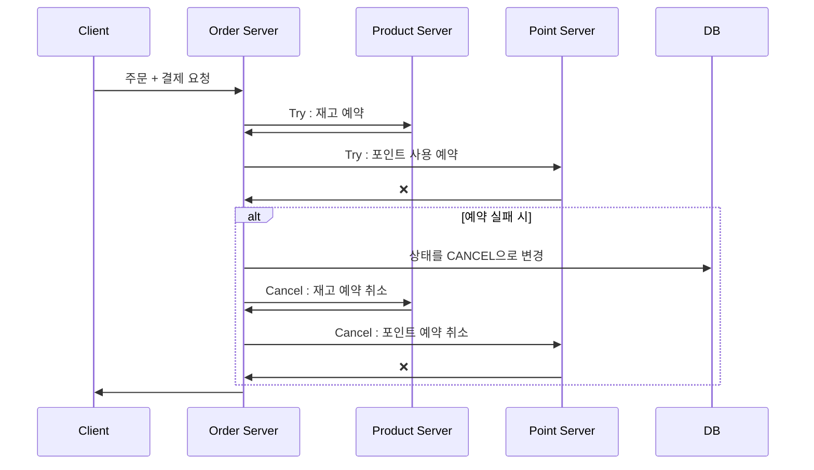
```mermaid
sequenceDiagram
    participant Client
    participant Order Server
    participant Product Server
    participant Point Server
    participant DB

    Client->>Order Server: 주문 + 결제 요청

    Order Server->>Product Server: Try : 재고 예약
    Product Server->>Order Server: 

    Order Server->>Point Server: Try : 포인트 사용 예약
    Point Server->>Order Server: ❌

    alt 예약 실패 시
        Order Server->>DB: 상태를 CANCEL으로 변경
        Order Server->>Product Server: Cancel : 재고 예약 취소
        Product Server->>Order Server: 
        Order Server->>Point Server: Cancel : 포인트 예약 취소
        Point Server->>Order Server: ❌
    end

    Order Server->>Client: 
```

- 취소 요청도 네트워크 통신을 통해 이루어지기 때문에 일부 자원이 제대로 취소되지 않는 문제가 발생할 수 있음

**발생할 수 있는 경우**

|케이스| Order     | Product   |Point|
|---|-----------|-----------|---|
|1| CANCELLED | Reserved  |Reserved|
|2| CANCELLED | CANCELLED |Reserved|
|3| CANCELLED | CANCELLED |CANCELLED|

**해결 전략: 스케줄러를 통한 자동 보정**

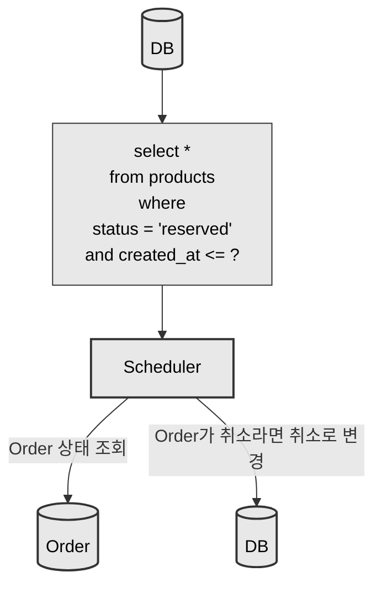
```mermaid
graph TB
    DB1[(DB)]
    Query["select *<br/>from products<br/>where<br/>status = 'reserved'<br/>and created_at <= ?"]
    Scheduler[Scheduler]
    OrderDB[(Order)]
    DB2[(DB)]
    
    DB1 --> Query
    Query --> Scheduler
    Scheduler -->|Order 상태 조회| OrderDB
    Scheduler -->|Order가 취소라면 취소로 변경| DB2
    
    style DB1 fill:#e8e8e8,stroke:#333,stroke-width:2px,color:#000
    style Query fill:#e8e8e8,stroke:#333,stroke-width:1px,color:#000
    style Scheduler fill:#e8e8e8,stroke:#333,stroke-width:2px,color:#000
    style OrderDB fill:#e8e8e8,stroke:#333,stroke-width:2px,color:#000
    style DB2 fill:#e8e8e8,stroke:#333,stroke-width:2px,color:#000
```

## 3. Saga
### 3-1. Saga란?
- 분산 시스템에서 데이터 정합성을 보장하기 위해 사용하는 분산 트랜잭션 처리 방식
- 각 작업을 개별 트랜잭션으로 나누고 실패 시에 보상 트랜잭션을 수행하여 정합성을 맞추는 방식
  - 보상 트랜잭션 로직은 멱등해야 하며 재시도가 가능해야 함.
- TCC와 달리 Saga는 리소스 예약 없이 즉시 상태 변경을 수행
  - 재고 차감 예약이 아닌 즉시 차감
  - 최종적 일관성(Eventual Consistency)을 보장
- Choreography 방식과 Orchestration 방식이 존재

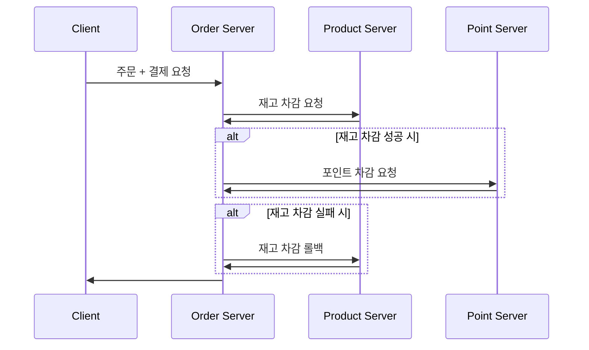
```mermaid
sequenceDiagram
    participant Client
    participant Order Server
    participant Product Server
    participant Point Server

    Client ->> Order Server: 주문 + 결제 요청
    Order Server ->> Product Server: 재고 차감 요청
    Product Server ->> Order Server: 

    alt 재고 차감 성공 시 
        Order Server ->> Point Server: 포인트 차감 요청
        Point Server ->> Order Server: 
    end
    
    alt 재고 차감 실패 시
        Order Server->>Product Server: 재고 차감 롤백
        Product Server->>Order Server: 
    end
    
    Order Server ->> Client: 
```

## 3-2. Orchestration
- Coordinator(또는 Orchestrator)가 각 참여 서비스들을 순차적으로 호출하며 전체 트랜잭션의 흐름을 제어하는 방식

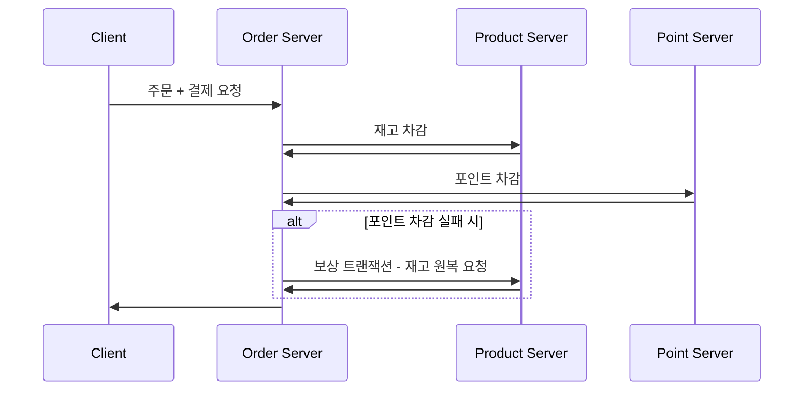
```mermaid
sequenceDiagram
    participant Client
    participant Order Server
    participant Product Server
    participant Point Server

    Client ->> Order Server: 주문 + 결제 요청
    
    Order Server ->> Product Server: 재고 차감
    Product Server ->> Order Server: 
    
    Order Server ->> Point Server: 포인트 차감
    Point Server ->> Order Server: 
    
    alt 포인트 차감 실패 시 
        Order Server ->> Product Server: 보상 트랜잭션 - 재고 원복 요청
        Product Server ->> Order Server: 
    end
    
    Order Server ->> Client: 
```

### 장점
- 구현 난이도와 유지보수 난이도가 낮음

### 단점
- 시간이 지날수록 Coordinator(Orchestrator)가 복잡해짐
- 서비스 간 결합도 증가

### 현재 구조의 문제점과 해결 방법
#### 현재 주문 처리 흐름

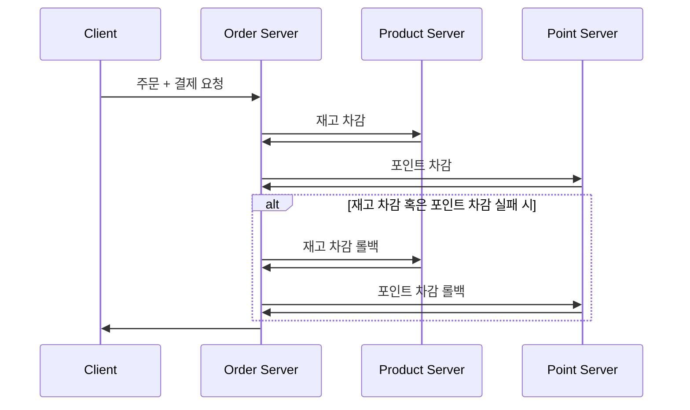
```mermaid
sequenceDiagram
  participant Client
  participant Order Server
  participant Product Server
  participant Point Server

  Client->>Order Server: 주문 + 결제 요청
  Order Server->>Product Server: 재고 차감
  Product Server->>Order Server: 
  Order Server->>Point Server: 포인트 차감
  Point Server->>Order Server: 

  alt 재고 차감 혹은 포인트 차감 실패 시
    Order Server->>Product Server: 재고 차감 롤백
    Product Server->>Order Server: 
    Order Server->>Point Server: 포인트 차감 롤백
    Point Server->>Order Server: 
  end

  Order Server->>Client: 
```

#### 롤백 도중 에러 발생 가능성

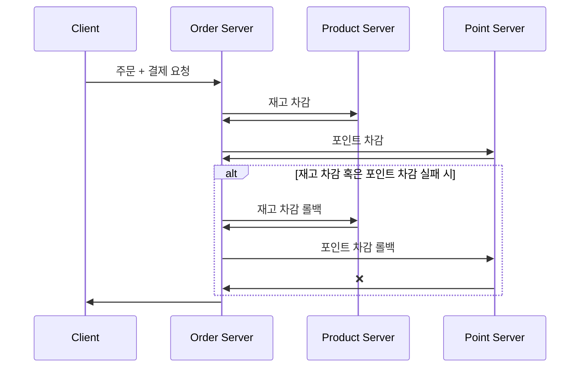
```mermaid
sequenceDiagram
  participant Client
  participant Order Server
  participant Product Server
  participant Point Server

  Client->>Order Server: 주문 + 결제 요청
  Order Server->>Product Server: 재고 차감
  Product Server->>Order Server: 
  Order Server->>Point Server: 포인트 차감
  Point Server->>Order Server: 

  alt 재고 차감 혹은 포인트 차감 실패 시
    Order Server->>Product Server: 재고 차감 롤백
    Product Server->>Order Server: 
    Order Server->>Point Server: 포인트 차감 롤백
    Point Server->>Order Server: ❌
  end

  Order Server->>Client: 
```

- 현재 구조에서는 주문의 상태만으로 문제를 유추해야 하므로 운영상 어려움이 발생할 수 있음 
- 롤백 도중 에러 발생 시 데이터를 기록하여 추후 재시도 가능하도록 처리 필요

#### 데이터 기반 롤백 재처리 흐름

```mermaid
sequenceDiagram
    participant Order Server
    participant DB
    participant Product Server
    participant Point Server

    Order Server ->> DB: 보상 트랜잭션 수행해야 할 목록 조회
    DB ->> Order Server: 

    Order Server ->> Product Server: 재고 차감 롤백 요청
    Product Server ->> Order Server: 

    Order Server ->> Point Server: 포인트 사용 롤백 요청
    Point Server ->> Order Server: 

    Order Server ->> DB: 처리 상태를 완료로 변경
    DB ->> Order Server: 
```

- 데이터 활용 방법: 주기적인 배치 프로그램이나 스케줄러를 통해 처리

## 3.3. Choreography
- Coordinator 없이 각 서비스가 이벤트를 발행하고 구독하며 트랜잭션 흐름을 제어하는 방식

```mermaid
sequenceDiagram
    title 주문 시스템 - 정상 시나리오
    
    participant Client
    participant Order Server
    participant Event Queue
    participant Product Server
    participant Point Server

    Client ->> Order Server: 주문 + 결제 요청
    Order Server ->> Event Queue: 재고 차감 Event 발행
    Event Queue ->> Product Server: Event 전달
    Product Server ->> Product Server: 재고 차감
    Product Server ->> Event Queue: 재고 차감 완료 Event 전달
    Event Queue ->> Point Server: Event 전달
    Point Server ->> Point Server: 포인트 차감
    Point Server ->> Event Queue: 포인트 차감 완료 Event 전달
    Event Queue ->> Order Server: Event 전달
    Order Server ->> Order Server: 주문 완료
```

```mermaid
sequenceDiagram
    title 주문 시스템 - 포인트 차감 실패 시나리오

    participant Client
    participant Order Server
    participant Event Queue
    participant Product Server
    participant Point Server

    Client ->> Order Server: 주문 + 결제 요청
    Order Server ->> Event Queue: 재고차감 Event 발행
    Event Queue ->> Product Server: Event 전달
    Product Server ->> Product Server: 재고차감
    Product Server ->> Event Queue: 재고차감 완료 Event 전달
    Event Queue ->> Point Server: Event 전달
    Point Server ->> Point Server: ❌ 포인트 차감 실패
    Point Server ->> Event Queue: 포인트 차감 실패 Event 전달
    Event Queue ->> Product Server: Event 전달
    Product Server ->> Product Server: 재고차감 롤백
```

### 장점
- 이벤트 기반으로 동작하다 보니 서비스 간 결합도가 낮음

### 단점
- 구현 난이도 상승
- 흐름 파악이 어려움

### Kafka란?
- 분산형 이벤트 스트리밍 플랫폼

```mermaid
%% Kafka 기본 구조
flowchart LR
    Producer --> Topic --> Consumer
```

- Producer: 이벤트를 생성하여 Kafka로 전송하는 역할
- Topic: 이벤트가 저장되는 논리적인 채널
- Consumer: Topic에서 이벤트를 구독하고 처리하는 역할

```yaml
version: "3.8"

services:
  kafka:
    image: bitnami/kafka:3.7
    container_name: kafka
    ports:
      - "9092:9092"
    environment:
      - BITNAMI_DEBUG=true
      - KAFKA_ENABLE_KRAFT=yes
      - KAFKA_KRAFT_CLUSTER_ID=abcdefghijklmnopqrstuv
      - KAFKA_CFG_NODE_ID=1
      - KAFKA_CFG_PROCESS_ROLES=broker,controller
      - KAFKA_CFG_CONTROLLER_QUORUM_VOTERS=1@kafka:9093

      - KAFKA_CFG_LISTENERS=PLAINTEXT://:9092,CONTROLLER://:9093
      - KAFKA_CFG_ADVERTISED_LISTENERS=PLAINTEXT://localhost:9092
      - KAFKA_CFG_LISTENER_SECURITY_PROTOCOL_MAP=PLAINTEXT:PLAINTEXT,CONTROLLER:PLAINTEXT
      - KAFKA_CFG_CONTROLLER_LISTENER_NAMES=CONTROLLER
      - KAFKA_CFG_INTER_BROKER_LISTENER_NAME=PLAINTEXT

      - ALLOW_PLAINTEXT_LISTENER=yes
      - KAFKA_CFG_AUTO_CREATE_TOPICS_ENABLE=true
```

- [Bitnami Kafka 이슈 참고](https://github.com/bitnami/containers/issues/86597)
- bitnami/kafka 이미지는 Bitnami Secure 이미지 구독을 통해서만 액세스 가능 
- 기존 무료 이미지를 사용하려면 bitnamilegacy/kafka 사용 (업데이트 지원 없음)

```yaml
version: "3.8"

services:
  kafka:
    image: bitnamilegacy/kafka:3.7
    container_name: kafka
    ...
```
