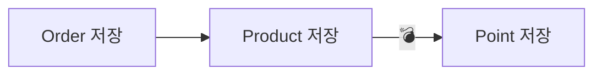
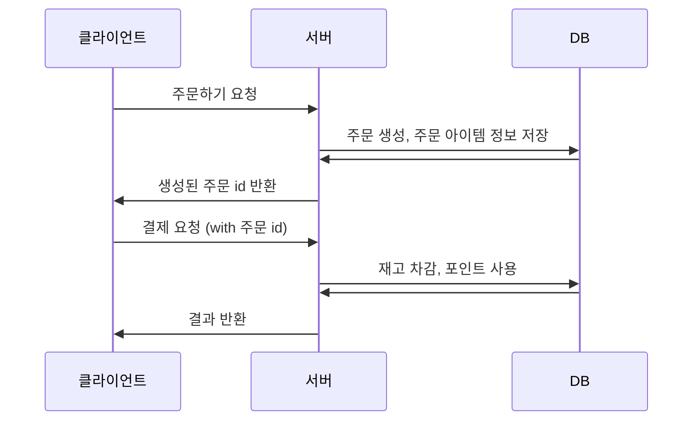
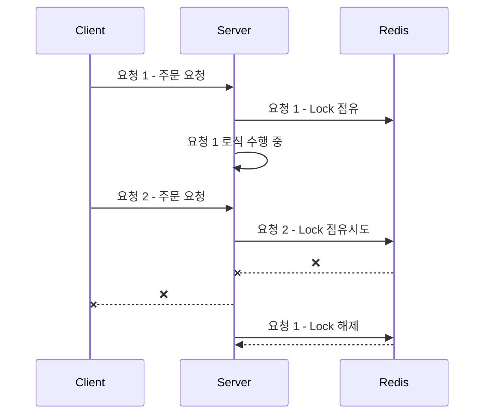

# distributed-transaction

이 레포지토리는 [주문시스템으로 알아보는 분산트랜잭션](https://www.inflearn.com/course/%EC%A3%BC%EB%AC%B8%EC%8B%9C%EC%8A%A4%ED%85%9C%EC%9C%BC%EB%A1%9C-%EC%95%8C%EC%95%84%EB%B3%B4%EB%8A%94-%EB%B6%84%EC%82%B0%ED%8A%B8%EB%9E%9C%EC%9E%AD%EC%85%98/news?srsltid=AfmBOooQslkAOakFKOdbYBUOMbsuAL8eOwz9iumPmyCearvhyhLLedBb) 강의를 바탕으로 정리한 내용입니다.

## 목차
- [프로젝트 세팅](#프로젝트-세팅)
  - [1. DB 세팅](#1-db-세팅)
  - [2. 요구사항 정의](#2-요구사항-정의)
- [주문 로직 구현](#주문-로직-구현)
  - [3-1. 데이터 정합성 문제](#3-1-데이터-정합성-문제)
  - [3-2. 동일한 주문 문제](#3-2-동일한-주문-문제)
  - [3-3. 여러 번 실행되는 문제](#3-3-여러-번-실행되는-문제)
    - [Redis 세팅](#redis-세팅)
    - [Redis Lock 구현](#redis-lock-구현)

## 프로젝트 세팅
### 1. DB 세팅
```
# Docker Run
$ docker run -d -p 3306:3306 \
    -e MYSQL_ROOT_PASSWORD=1234 --name mysql mysql
    
# 실행 결과 확인
$ docker ps

# DB 테이블 생성
$ docker exec -it mysql bash     # Docker Container Bash 접속
$ mysql -u root -p 1234           # mysql 접속
$ CREATE DATABASE commerce_example; # DB Table 생성
$ USE commerce_example;         
```

### 2. 요구사항 정의
- 주문 데이터를 저장해야 한다.
- 재고 관리를 해야 한다.
- 포인트를 사용해야 한다.
- 주문, 재고, 포인트 데이터의 정합성이 맞아야 한다.
- 동일한 주문은 1번만 이루어져야 한다.

## 주문 로직 구현
```java
public void placeOrder(PlaceOrderCommand command) {
    Order order = orderRepository.save(new Order());
    Long totalPrice = 0L;

    for (PlaceOrderCommand.OrderItem item : command.orderItems()) {
        OrderItem orderItem = new OrderItem(order.getId(), item.productId(), item.quantity());
        orderItemRepository.save(orderItem);

        Long price = productService.buy(item.productId(), item.quantity());
        totalPrice += price;
    }

    pointService.use(1L, totalPrice);
}
```

```http request
POST http://localhost:8080/order/place
Content-Type: application/json

{
    "orderItems": [
        {
            "productId": 1,
            "quantity": 2
        },
        {
            "productId": 2,
            "quantity": 2
        }
    ]
}
```


### 3-1. 데이터 정합성 문제
- Order 저장과 Product 저장은 성공했지만 Point 저장이 실패하면 Point 저장이 되지 않고 Order, Product 저장은 된 상태가 됨
- 해결책: 트랜잭션의 원자성을 이용해서 모두 성공하거나 모두 실패하게 만들기



```java
@Transactional
public void placeOrder(PlaceOrderCommand command) {
    ...
}
```

### 3-2. 동일한 주문 문제
- 동일한 주문이 여러 번 실행됨
- 해결책: 주문 id를 클라이언트에게 반환하여 동일한 주문인지 판별



### 3-3. 여러 번 실행되는 문제
- 위 과정을 통해 동일한 주문을 판별할 수 있지만, 여러 번 실행되는 문제는 여전히 존재
- 해결책: 여러 번 실행되지 않도록 Lock 활용



#### Redis 세팅
```
docker pull redis
docker run --name myredis -p 6379:6379 -d redis
docker exec -it myredis redis-cli
```
#### Redis Lock 구현
```java
@Service
public class RedisLockService {

    private final StringRedisTemplate stringRedisTemplate;

    public RedisLockService(StringRedisTemplate stringRedisTemplate) {
        this.stringRedisTemplate = stringRedisTemplate;
    }

    public boolean tryLock(String key, String value) {
        return stringRedisTemplate.opsForValue().setIfAbsent(key, value);
    }

    public void releaseLock(String key) {
        stringRedisTemplate.delete(key);
    }
}
```
